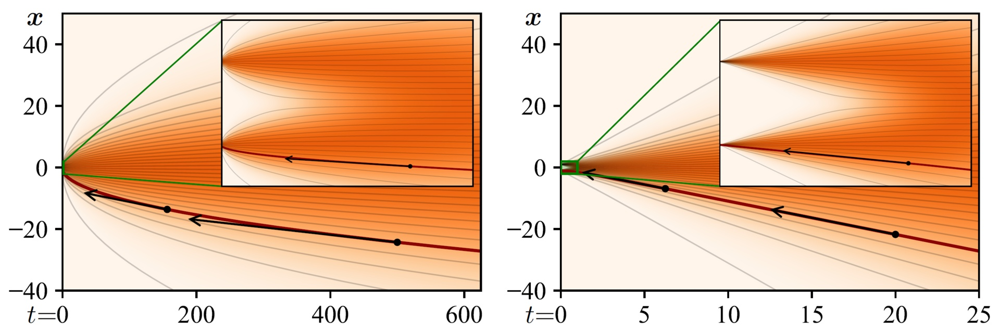

## Elucidating the Design Space of Diffusion-Based Generative Models (EDM)<br><sub>Official PyTorch implementation of the NeurIPS 2022 paper</sub>



**Elucidating the Design Space of Diffusion-Based Generative Models**<br>
Tero Karras, Miika Aittala, Timo Aila, Samuli Laine
<br>https://arxiv.org/abs/2206.00364<br>

Abstract: *We argue that the theory and practice of diffusion-based generative models are currently unnecessarily convoluted and seek to remedy the situation by presenting a design space that clearly separates the concrete design choices. This lets us identify several changes to both the sampling and training processes, as well as preconditioning of the score networks. Together, our improvements yield new state-of-the-art FID of 1.79 for CIFAR-10 in a class-conditional setting and 1.97 in an unconditional setting, with much faster sampling (35 network evaluations per image) than prior designs. To further demonstrate their modular nature, we show that our design changes dramatically improve both the efficiency and quality obtainable with pre-trained score networks from previous work, including improving the FID of a previously trained ImageNet-64 model from 2.07 to near-SOTA 1.55, and after re-training with our proposed improvements to a new SOTA of 1.36.*

For business inquiries, please visit our website and submit the form: [NVIDIA Research Licensing](https://www.nvidia.com/en-us/research/inquiries/)

## Requirements

* Linux and Windows are supported, but we recommend Linux for performance and compatibility reasons.
* 1+ high-end NVIDIA GPU for sampling and 8+ GPUs for training. We have done all testing and development using V100 and A100 GPUs.
* 64-bit Python 3.8 and PyTorch 1.12.0 (or later). See https://pytorch.org for PyTorch install instructions.
* Python libraries: See [environment.yml](./environment.yml) for exact library dependencies. You can use the following commands with Miniconda3 to create and activate your Python environment:
  - `conda env create -f environment.yml -n edm`
  - `conda activate edm`
* Docker users:
  - Ensure you have correctly installed the [NVIDIA container runtime](https://docs.docker.com/config/containers/resource_constraints/#gpu).
  - Use the [provided Dockerfile](./Dockerfile) to build an image with the required library dependencies.

## Getting started

To reproduce the main results from our paper, simply run:

```.bash
python example.py
```

This is a minimal standalone script that loads the best pre-trained model for each dataset and generates a random 8x8 grid of images using the optimal sampler settings. Expected results:

| Dataset  | Runtime | Reference image
| :------- | :------ | :--------------
| CIFAR-10 | ~6 sec  | [`cifar10-32x32.png`](./docs/cifar10-32x32.png)
| FFHQ     | ~28 sec | [`ffhq-64x64.png`](./docs/ffhq-64x64.png)
| AFHQv2   | ~28 sec | [`afhqv2-64x64.png`](./docs/afhqv2-64x64.png)
| ImageNet | ~5 min  | [`imagenet-64x64.png`](./docs/imagenet-64x64.png)

The easiest way to explore different sampling strategies is to modify [`example.py`](./example.py) directly. You can also incorporate the pre-trained models and/or our proposed EDM sampler in your own code by simply copy-pasting the relevant bits. Note that the class definitions for the pre-trained models are stored within the pickles themselves and loaded automatically during unpickling via [`torch_utils.persistence`](./torch_utils/persistence.py). To use the models in external Python scripts, just make sure that `torch_utils` and `dnnlib` are accesible through `PYTHONPATH`.

**Docker**: You can run the example script using Docker as follows:

```.bash
# Build the edm:latest image
docker build --tag edm:latest .

# Run the generate.py script using Docker:
docker run --gpus all -it --rm --user $(id -u):$(id -g) \
    -v `pwd`:/scratch --workdir /scratch -e HOME=/scratch \
    edm:latest \
    python example.py
```

Note: The Docker image requires NVIDIA driver release `r520` or later.

The `docker run` invocation may look daunting, so let's unpack its contents here:

- `--gpus all -it --rm --user $(id -u):$(id -g)`: with all GPUs enabled, run an interactive session with current user's UID/GID to avoid Docker writing files as root.
- ``-v `pwd`:/scratch --workdir /scratch``: mount current running dir (e.g., the top of this git repo on your host machine) to `/scratch` in the container and use that as the current working dir.
- `-e HOME=/scratch`: specify where to cache temporary files. Note: if you want more fine-grained control, you can instead set `DNNLIB_CACHE_DIR` (for pre-trained model download cache). You want these cache dirs to reside on persistent volumes so that their contents are retained across multiple `docker run` invocations.

## Pre-trained models

We provide pre-trained models for our proposed training configuration (config F) as well as the baseline configuration (config A):

- [https://nvlabs-fi-cdn.nvidia.com/edm/pretrained/](https://nvlabs-fi-cdn.nvidia.com/edm/pretrained/)
- [https://nvlabs-fi-cdn.nvidia.com/edm/pretrained/baseline/](https://nvlabs-fi-cdn.nvidia.com/edm/pretrained/baseline/)

To generate a batch of images using a given model and sampler, run:

```.bash
# Generate 64 images and save them as out/*.png
python generate.py --outdir=out --seeds=0-63 --batch=64 \
    --network=https://nvlabs-fi-cdn.nvidia.com/edm/pretrained/edm-cifar10-32x32-cond-vp.pkl
```

Generating a large number of images can be time-consuming; the workload can be distributed across multiple GPUs by launching the above command using `torchrun`:

```.bash
# Generate 1024 images using 2 GPUs
torchrun --standalone --nproc_per_node=2 generate.py --outdir=out --seeds=0-999 --batch=64 \
    --network=https://nvlabs-fi-cdn.nvidia.com/edm/pretrained/edm-cifar10-32x32-cond-vp.pkl
```

The sampler settings can be controlled through command-line options; see [`python generate.py --help`](./docs/generate-help.txt) for more information. For best results, we recommend using the following settings for each dataset:

```.bash
# For CIFAR-10 at 32x32, use deterministic sampling with 18 steps (NFE = 35)
python generate.py --outdir=out --steps=18 \
    --network=https://nvlabs-fi-cdn.nvidia.com/edm/pretrained/edm-cifar10-32x32-cond-vp.pkl

# For FFHQ and AFHQv2 at 64x64, use deterministic sampling with 40 steps (NFE = 79)
python generate.py --outdir=out --steps=40 \
    --network=https://nvlabs-fi-cdn.nvidia.com/edm/pretrained/edm-ffhq-64x64-uncond-vp.pkl

# For ImageNet at 64x64, use stochastic sampling with 256 steps (NFE = 511)
python generate.py --outdir=out --steps=256 --S_churn=40 --S_min=0.05 --S_max=50 --S_noise=1.003 \
    --network=https://nvlabs-fi-cdn.nvidia.com/edm/pretrained/edm-imagenet-64x64-cond-adm.pkl
```

Besides our proposed EDM sampler, `generate.py` can also be used to reproduce the sampler ablations from Section 3 of our paper. For example:

```.bash
# Figure 2a, "Our reimplementation"
python generate.py --outdir=out --steps=512 --solver=euler --disc=vp --schedule=vp --scaling=vp \
    --network=https://nvlabs-fi-cdn.nvidia.com/edm/pretrained/baseline/baseline-cifar10-32x32-uncond-vp.pkl

# Figure 2a, "+ Heun & our {t_i}"
python generate.py --outdir=out --steps=128 --solver=heun --disc=edm --schedule=vp --scaling=vp \
    --network=https://nvlabs-fi-cdn.nvidia.com/edm/pretrained/baseline/baseline-cifar10-32x32-uncond-vp.pkl

# Figure 2a, "+ Our sigma(t) & s(t)"
python generate.py --outdir=out --steps=18 --solver=heun --disc=edm --schedule=linear --scaling=none \
    --network=https://nvlabs-fi-cdn.nvidia.com/edm/pretrained/baseline/baseline-cifar10-32x32-uncond-vp.pkl
```

## Calculating FID

To compute Fr&eacute;chet inception distance (FID) for a given model and sampler, first generate 50,000 random images and then compare them against the dataset reference statistics using `fid.py`:

```.bash
# Generate 50000 images and save them as fid-tmp/*/*.png
torchrun --standalone --nproc_per_node=1 generate.py --outdir=fid-tmp --seeds=0-49999 --subdirs \
    --network=https://nvlabs-fi-cdn.nvidia.com/edm/pretrained/edm-cifar10-32x32-cond-vp.pkl

# Calculate FID
torchrun --standalone --nproc_per_node=1 fid.py calc --images=fid-tmp \
    --ref=https://nvlabs-fi-cdn.nvidia.com/edm/fid-refs/cifar10-32x32.npz
```

Both of the above commands can be parallelized across multiple GPUs by adjusting `--nproc_per_node`. The second command typically takes 1-3 minutes in practice, but the first one can sometimes take several hours, depending on the configuration. See [`python fid.py --help`](./docs/fid-help.txt) for the full list of options.

Note that the numerical value of FID varies across different random seeds and is highly sensitive to the number of images. By default, `fid.py` will always use 50,000 generated images; providing fewer images will result in an error, whereas providing more will use a random subset. To reduce the effect of random variation, we recommend repeating the calculation multiple times with different seeds, e.g., `--seeds=0-49999`, `--seeds=50000-99999`, and `--seeds=100000-149999`. In our paper, we calculated each FID three times and reported the minimum.

Also note that it is important to compare the generated images against the same dataset that the model was originally trained with. To facilitate evaluation, we provide the exact reference statistics that correspond to our pre-trained models:

* [https://nvlabs-fi-cdn.nvidia.com/edm/fid-refs/](https://nvlabs-fi-cdn.nvidia.com/edm/fid-refs/)

For ImageNet, we provide two sets of reference statistics to enable apples-to-apples comparison: `imagenet-64x64.npz` should be used when evaluating the EDM model (`edm-imagenet-64x64-cond-adm.pkl`), whereas `imagenet-64x64-baseline.npz` should be used when evaluating the baseline model (`baseline-imagenet-64x64-cond-adm.pkl`); the latter was originally trained by Dhariwal and Nichol using slightly different training data.

You can compute the reference statistics for your own datasets as follows:

```.bash
python fid.py ref --data=datasets/my-dataset.zip --dest=fid-refs/my-dataset.npz
```

## Preparing datasets

Datasets are stored in the same format as in [StyleGAN](https://github.com/NVlabs/stylegan3): uncompressed ZIP archives containing uncompressed PNG files and a metadata file `dataset.json` for labels. Custom datasets can be created from a folder containing images; see [`python dataset_tool.py --help`](./docs/dataset-tool-help.txt) for more information.

**CIFAR-10:** Download the [CIFAR-10 python version](https://www.cs.toronto.edu/~kriz/cifar.html) and convert to ZIP archive:

```.bash
python dataset_tool.py --source=downloads/cifar10/cifar-10-python.tar.gz \
    --dest=datasets/cifar10-32x32.zip
python fid.py ref --data=datasets/cifar10-32x32.zip --dest=fid-refs/cifar10-32x32.npz
```

**FFHQ:** Download the [Flickr-Faces-HQ dataset](https://github.com/NVlabs/ffhq-dataset) as 1024x1024 images and convert to ZIP archive at 64x64 resolution:

```.bash
python dataset_tool.py --source=downloads/ffhq/images1024x1024 \
    --dest=datasets/ffhq-64x64.zip --resolution=64x64
python fid.py ref --data=datasets/ffhq-64x64.zip --dest=fid-refs/ffhq-64x64.npz
```

**AFHQv2:** Download the updated [Animal Faces-HQ dataset](https://github.com/clovaai/stargan-v2/blob/master/README.md#animal-faces-hq-dataset-afhq) (`afhq-v2-dataset`) and convert to ZIP archive at 64x64 resolution:

```.bash
python dataset_tool.py --source=downloads/afhqv2 \
    --dest=datasets/afhqv2-64x64.zip --resolution=64x64
python fid.py ref --data=datasets/afhqv2-64x64.zip --dest=fid-refs/afhqv2-64x64.npz
```

**ImageNet:** Download the [ImageNet Object Localization Challenge](https://www.kaggle.com/competitions/imagenet-object-localization-challenge/data) and convert to ZIP archive at 64x64 resolution:

```.bash
python dataset_tool.py --source=downloads/imagenet/ILSVRC/Data/CLS-LOC/train \
    --dest=datasets/imagenet-64x64.zip --resolution=64x64 --transform=center-crop
python fid.py ref --data=datasets/imagenet-64x64.zip --dest=fid-refs/imagenet-64x64.npz
```

## Training new models

You can train new models using `train.py`. For example:

```.bash
# Train DDPM++ model for class-conditional CIFAR-10 using 8 GPUs
torchrun --standalone --nproc_per_node=8 train.py --outdir=training-runs \
    --data=datasets/cifar10-32x32.zip --cond=1 --arch=ddpmpp
```

The above example uses the default batch size of 512 images (controlled by `--batch`) that is divided evenly among 8 GPUs (controlled by `--nproc_per_node`) to yield 64 images per GPU. Training large models may run out of GPU memory; the best way to avoid this is to limit the per-GPU batch size, e.g., `--batch-gpu=32`. This employs gradient accumulation to yield the same results as using full per-GPU batches. See [`python train.py --help`](./docs/train-help.txt) for the full list of options.

The results of each training run are saved to a newly created directory, for example `training-runs/00000-cifar10-cond-ddpmpp-edm-gpus8-batch64-fp32`. The training loop exports network snapshots (`network-snapshot-*.pkl`) and training states (`training-state-*.pt`) at regular intervals (controlled by `--snap` and `--dump`). The network snapshots can be used to generate images with `generate.py`, and the training states can be used to resume the training later on (`--resume`). Other useful information is recorded in `log.txt` and `stats.jsonl`. To monitor training convergence, we recommend looking at the training loss (`"Loss/loss"` in `stats.jsonl`) as well as periodically evaluating FID for `network-snapshot-*.pkl` using `generate.py` and `fid.py`.

The following table lists the exact training configurations that we used to obtain our pre-trained models:

| <sub>Model</sub> | <sub>GPUs</sub> | <sub>Time</sub> | <sub>Options</sub>
| :-- | :-- | :-- | :--
| <sub>cifar10&#8209;32x32&#8209;cond&#8209;vp</sub>   | <sub>8xV100</sub>  | <sub>~2&nbsp;days</sub>  | <sub>`--cond=1 --arch=ddpmpp`</sub>
| <sub>cifar10&#8209;32x32&#8209;cond&#8209;ve</sub>   | <sub>8xV100</sub>  | <sub>~2&nbsp;days</sub>  | <sub>`--cond=1 --arch=ncsnpp`</sub>
| <sub>cifar10&#8209;32x32&#8209;uncond&#8209;vp</sub> | <sub>8xV100</sub>  | <sub>~2&nbsp;days</sub>  | <sub>`--cond=0 --arch=ddpmpp`</sub>
| <sub>cifar10&#8209;32x32&#8209;uncond&#8209;ve</sub> | <sub>8xV100</sub>  | <sub>~2&nbsp;days</sub>  | <sub>`--cond=0 --arch=ncsnpp`</sub>
| <sub>ffhq&#8209;64x64&#8209;uncond&#8209;vp</sub>    | <sub>8xV100</sub>  | <sub>~4&nbsp;days</sub>  | <sub>`--cond=0 --arch=ddpmpp --batch=256 --cres=1,2,2,2 --lr=2e-4 --dropout=0.05 --augment=0.15`</sub>
| <sub>ffhq&#8209;64x64&#8209;uncond&#8209;ve</sub>    | <sub>8xV100</sub>  | <sub>~4&nbsp;days</sub>  | <sub>`--cond=0 --arch=ncsnpp --batch=256 --cres=1,2,2,2 --lr=2e-4 --dropout=0.05 --augment=0.15`</sub>
| <sub>afhqv2&#8209;64x64&#8209;uncond&#8209;vp</sub>  | <sub>8xV100</sub>  | <sub>~4&nbsp;days</sub>  | <sub>`--cond=0 --arch=ddpmpp --batch=256 --cres=1,2,2,2 --lr=2e-4 --dropout=0.25 --augment=0.15`</sub>
| <sub>afhqv2&#8209;64x64&#8209;uncond&#8209;ve</sub>  | <sub>8xV100</sub>  | <sub>~4&nbsp;days</sub>  | <sub>`--cond=0 --arch=ncsnpp --batch=256 --cres=1,2,2,2 --lr=2e-4 --dropout=0.25 --augment=0.15`</sub>
| <sub>imagenet&#8209;64x64&#8209;cond&#8209;adm</sub> | <sub>32xA100</sub> | <sub>~13&nbsp;days</sub> | <sub>`--cond=1 --arch=adm --duration=2500 --batch=4096 --lr=1e-4 --ema=50 --dropout=0.10 --augment=0 --fp16=1 --ls=100 --tick=200`</sub>

For ImageNet-64, we ran the training on four NVIDIA DGX A100 nodes, each containing 8 Ampere GPUs with 80 GB of memory. To reduce the GPU memory requirements, we recommend either training the model with more GPUs or limiting the per-GPU batch size with `--batch-gpu`. To set up multi-node training, please consult the [torchrun documentation](https://pytorch.org/docs/stable/elastic/run.html).

## License

Copyright &copy; 2022, NVIDIA CORPORATION & AFFILIATES. All rights reserved.

All material, including source code and pre-trained models, is licensed under the [Creative Commons Attribution-NonCommercial-ShareAlike 4.0 International License](http://creativecommons.org/licenses/by-nc-sa/4.0/).

`baseline-cifar10-32x32-uncond-vp.pkl` and `baseline-cifar10-32x32-uncond-ve.pkl` are derived from the [pre-trained models](https://github.com/yang-song/score_sde_pytorch) by Yang Song, Jascha Sohl-Dickstein, Diederik P. Kingma, Abhishek Kumar, Stefano Ermon, and Ben Poole. The models were originally shared under the [Apache 2.0 license](https://github.com/yang-song/score_sde_pytorch/blob/main/LICENSE).

`baseline-imagenet-64x64-cond-adm.pkl` is derived from the [pre-trained model](https://github.com/openai/guided-diffusion) by Prafulla Dhariwal and Alex Nichol. The model was originally shared under the [MIT license](https://github.com/openai/guided-diffusion/blob/main/LICENSE).

`imagenet-64x64-baseline.npz` is derived from the [precomputed reference statistics](https://github.com/openai/guided-diffusion/tree/main/evaluations) by Prafulla Dhariwal and Alex Nichol. The statistics were
originally shared under the [MIT license](https://github.com/openai/guided-diffusion/blob/main/LICENSE).

## Citation

```
@inproceedings{Karras2022edm,
  author    = {Tero Karras and Miika Aittala and Timo Aila and Samuli Laine},
  title     = {Elucidating the Design Space of Diffusion-Based Generative Models},
  booktitle = {Proc. NeurIPS},
  year      = {2022}
}
```

## Development

This is a research reference implementation and is treated as a one-time code drop. As such, we do not accept outside code contributions in the form of pull requests.

## Acknowledgments

We thank Jaakko Lehtinen, Ming-Yu Liu, Tuomas Kynk&auml;&auml;nniemi, Axel Sauer, Arash Vahdat, and Janne Hellsten for discussions and comments, and Tero Kuosmanen, Samuel Klenberg, and Janne Hellsten for maintaining our compute infrastructure.
